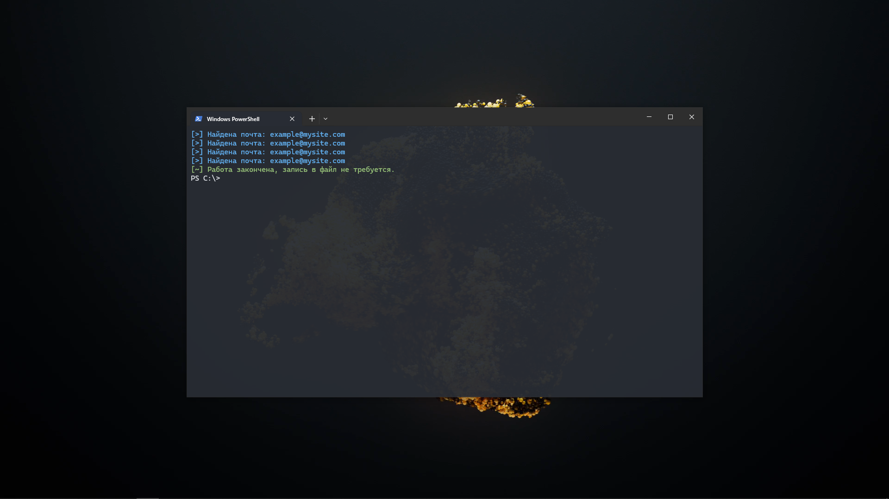

# Parsi 📧🔍

Parsi - это просто и мощный инструмент для извлечения электронных адресов с веб-сайтов, написанный на языке программирования Rust.

## Как использовать

1. **Установка Rust:**
   Убедитесь, что у вас установлен Rust на вашем компьютере. Если нет, вы можете скачать и установить его с [официального сайта Rust](https://www.rust-lang.org/tools/install).

2. **Клонирование репозитория:**
   ```bash
   git clone https://github.com/jonifon/parsi.git
   cd parsi
   ```

3. **Запуск:**
   ```bash
   cargo run --release -- --list urls.txt --output emails.txt
   ```
   Замените `urls.txt` на путь к вашему файлу с URL-адресами, и `emails.txt` на желаемый путь к файлу для сохранения извлеченных почт.

## Скриншот



## Важно
Parsi предназначен для использования в соответствии с законами и правилами, касающимися сбора и использования электронных адресов.

## Лицензия
Parsi распространяется под лицензией MIT. Подробности см. в файле [LICENSE](LICENSE).
